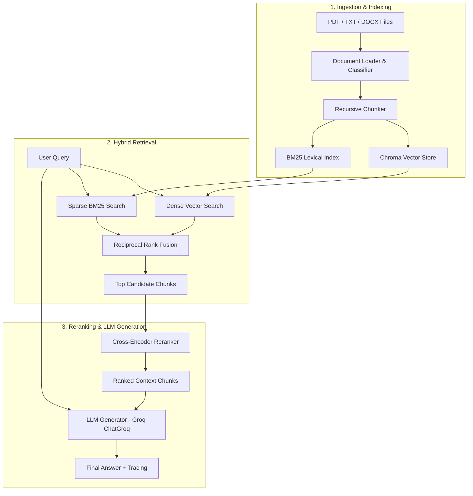

# Insurance Policy RAG Pipeline

A **Hybrid RAG** system built for insurance policy document search.

Combines **Dense Vector Search** (ChromaDB + Nomic Embed) with **Sparse Lexical Search** (BM25), fused via **Reciprocal Rank Fusion (RRF)**, re-ranked using a **Cross-Encoder model** (`BAAI/bge-reranker-v2-m3`), and monitored with **Langfuse tracing** and **DeepEval benchmark evaluation**.

https://github.com/user-attachments/assets/77b0a9de-0414-4c0f-bb3d-5bc71f879739

---

## Key Features

- **Hybrid Retrieval Engine**:
  - **Dense Vector Search**: Semantic similarity using `nomic-ai/nomic-embed-text-v1.5`.
  - **Sparse Lexical Search**: BM25 keyword matching for exact key-term/policy-number retrieval.
  - **Reciprocal Rank Fusion (RRF)**: Weighted fusion balancing keyword accuracy ($0.4$) and semantic depth ($0.6$).
- **Cross-Encoder Reranking**: Advanced two-stage retrieval using `BAAI/bge-reranker-v2-m3` to score retrieved candidate chunks prior to LLM generation.
- **Automated Policy Classification**: Automatic classification of document policy categories (`policy_classifier.py`).
- **Observability & Tracing**: Native **Langfuse** integration (`@observe` spans) tracking query latency, retrieved context chunks, and generation outputs.
- **DeepEval Evaluation Suite**:
  - **Retriever Benchmarking**: Contextual Recall & Contextual Precision.
  - **Generator Benchmarking**: Faithfulness & Answer Relevancy using golden contexts.
  - **End-to-End Pipeline Evaluation**: Full pipeline validation.
- **Interactive Interfaces**:
  - **Streamlit Web Application**: Chat interface with fixed viewport input and document upload interface.
  - **CLI Interactive Shell**: Command-line interface for rapid testing and batch indexing.
---

## Architecture & Pipeline Flow



---

## Technology Stack

| Component | Technology / Library |
| :--- | :--- |
| **Framework & Orchestration** | LangChain, Python 3.12 |
| **Vector Store** | ChromaDB (`chromadb`, `langchain-chroma`) |
| **Embedding Model** | `nomic-ai/nomic-embed-text-v1.5` (`sentence-transformers`) |
| **Sparse Lexical Search** | `rank-bm25` |
| **Reranker** | `BAAI/bge-reranker-v2-m3` (`SentenceTransformer`) |
| **LLM Generator** | Groq API (`ChatGroq` - `openai/gpt-oss-20b` via `langchain-groq`) |
| **LLM-as-a-Judge (Eval)** | OpenAI API (`gpt-4o-mini` / `gpt-4o` via `deepeval`) |
| **Observability** | Langfuse (`langfuse`) |
| **Evaluation** | DeepEval (`deepeval`) |
| **Web UI** | Streamlit (`streamlit`) |

---

## 📁 Repository Structure

```text
├── app.py                   # Interactive CLI shell & traced query pipeline
├── streamlit_app.py         # Streamlit Web UI (Chat & Document Upload)
├── export_chroma_chunks.py  # Utility script to export indexed vector chunks
├── main.py                  # CLI entry point wrapper
├── pyproject.toml           # UV / Project dependency definitions
├── requirements.txt         # Pip package requirements
├── src/                     # Core RAG Library
│   ├── chunking.py          # Document chunking logic
│   ├── data_loader.py       # Multi-format document loading & metadata tagger
│   ├── document_indexer.py  # Indexing pipeline manager
│   ├── embeddings.py        # Nomic text embedding wrapper
│   ├── generator.py         # Prompt engineering & LLM generation wrapper
│   ├── hybrid_search.py     # Hybrid search & Reciprocal Rank Fusion (RRF)
│   ├── policy_classifier.py # Automatic document policy category classifier
│   ├── reranker.py          # BAAI Cross-Encoder re-ranker wrapper
│   ├── search.py            # Basic dense vector search interface
│   ├── sparse_search.py     # BM25 keyword search interface
│   └── vectorstore.py       # ChromaDB vector database wrapper
├── evals/                   # DeepEval Benchmark Evaluation Suite
│   ├── eval_retriever.py    # Isolated Retriever evaluation (Recall & Precision)
│   ├── eval_generator.py    # Isolated Generator evaluation (Faithfulness & Relevancy)
│   └── eval_rag_pipeline.py # End-to-end full pipeline benchmarking
└── scripts/                 # Debugging and analysis scripts
    ├── debug_chunking.py    # Chunking visually & testing script
    └── debug_vectorstore.py # Vector database querying inspector
```

---

## 🚀 Quick Start

### 1. Prerequisites & Environment Setup

Clone the repository and set up environment variables:

```bash
git clone https://github.com/patilshrinivas078/hybrid-search-RAG.git
cd hybrid-search-RAG
```

Create a `.env` file in the project root:

```env
GROQ_API_KEY=your_groq_api_key_here
OPENAI_API_KEY=your_openai_api_key_here
LANGFUSE_PUBLIC_KEY=your_langfuse_public_key
LANGFUSE_SECRET_KEY=your_langfuse_secret_key
LANGFUSE_HOST=https://cloud.langfuse.com
```

### 2. Installation

Install dependencies using [`uv`](https://github.com/astral-sh/uv) or `pip`:

**Using UV (Recommended)**:
```bash
uv sync
```

**Using Pip**:
```bash
pip install -r requirements.txt
```

---

## 💻 Running the Applications

### 🌐 Streamlit Web Application

Launch the interactive dual-page web application (Chat Q&A + Document Upload):

```bash
streamlit run streamlit_app.py
```

- **Ask Questions**: Interactive chat interface pinned to the viewport for smooth multi-turn conversations.
- **Upload Documents**: Upload new PDF, TXT, or DOCX files to enrich the knowledge base permanently.

### 🖥️ Interactive CLI Shell

Run the command-line interface for rapid local testing:

```bash
python app.py
```

---

## 📊 Evaluation & Benchmarking

Run component-level or end-to-end benchmark evaluation suites using **DeepEval**:

```bash
# Evaluate Retriever (Contextual Recall & Contextual Precision)
python evals/eval_retriever.py

# Evaluate Generator (Faithfulness & Answer Relevancy)
python evals/eval_generator.py

# Evaluate Full End-to-End RAG Pipeline
python evals/eval_rag_pipeline.py
```

---

## 🔍 Debugging & Utilities

- **Chunk Visualizer**:
  ```bash
  python scripts/debug_chunking.py
  ```
- **Vector Store Inspector**:
  ```bash
  python scripts/debug_vectorstore.py
  ```
- **Export Vector Store Chunks**:
  ```bash
  python export_chroma_chunks.py
  ```

---

## License

This project is licensed under the [MIT License][LICENSE](LICENSE)
